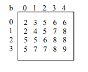

# Given is a 2-dimensional integer array [0..m-1, 0..n-1], each row and column of which is in ascending order (see example).

Example:

# Write a Java program to find the row, column position of a specified number (row, column position) in a given 2-dimensional array.
