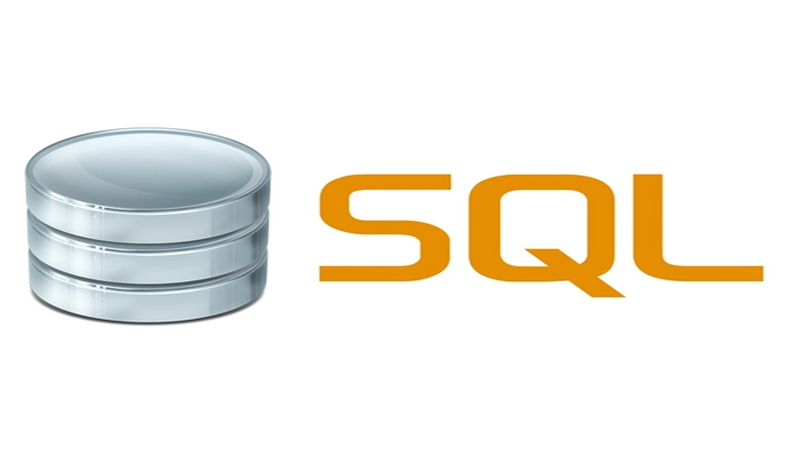

# SQL

### What to learn

| Name | Description | url |
|---|---|---|
|Learning resource| Resource |[tap to read](https://www.w3schools.com/sql/)|
|Postgresql| Database |[tap to read](https://www.postgresql.org/)|
|Download links|For Windows|[tap to read](https://www.postgresql.org/download/windows/)|
|Download links|For Linux|[tap to read](https://www.postgresql.org/download/linux)|
|Download links|For Mac|[tap to read](https://www.postgresql.org/download/macosx/)|
|Postgresql |How to download postgresql |[tap to read](https://www.guru99.com/download-install-postgresql.html)|    

